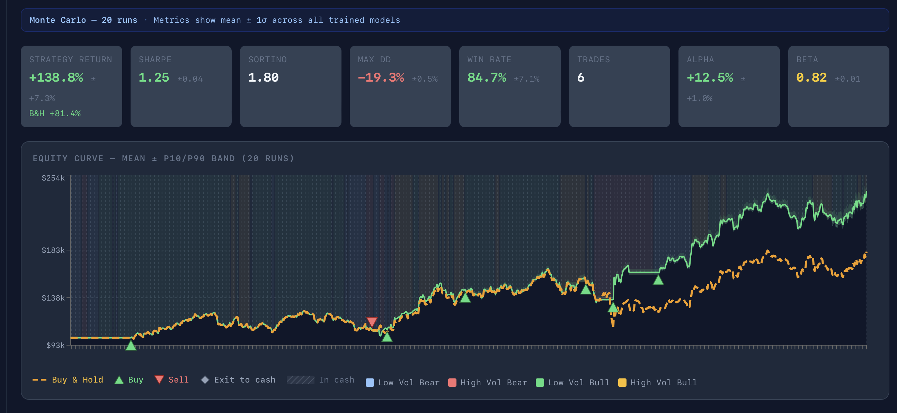

# Regime-Switching Algorithmic Trading Platform
 
A full-stack algorithmic trading research platform that classifies market regimes using realized volatility percentiles and trend ratios, then routes predictions to dedicated deep learning models trained exclusively on data from each regime. Augmented with Topological Data Analysis (TDA) persistence features.
 
**Paper →** [Full Write-Up (Overleaf)](https://www.overleaf.com/read/kbqchgyjfbwy)
 
---
 
## Results
 
Backtested on AAPL (2010–2024), 20 Monte Carlo runs, walk-forward validation (80/20 IS/OOS split), realistic broker simulation (commissions, slippage, spread, execution lag):
 
| Metric | Strategy | Buy & Hold |
|---|---|---|
| Total Return | +138.8% ± 7.3% | +81.4% |
| Sharpe Ratio | 1.25 ± 0.04 | — |
| Sortino Ratio | 1.80 | — |
| Max Drawdown | −19.3% ± 0.5% | — |
| Win Rate | 84.7% ± 7.1% | — |
| Alpha (annualized) | +12.5% ± 1.0% | — |
| Beta | 0.82 ± 0.01 | — |
 
### Ablation Study

Ablation Study Table:

|    Configuration      | Sharpe | Return | Max DD |
|------------------------|--------|--------|--------|
|      Full system       | 1.25 | +138.8% | −19.3% |
|  Without TDA features  | 1.08 | +112.1% | −22.0% |
| Without 200-SMA filter  | 0.86 | +81.7% | −22.3% |
| Single model (TCN only) | 0.23 | +2.1%  | −5.0%  |
 
TDA features contribute roughly 0.17 Sharpe and 27 percentage points of return. Regime routing is by far the largest contributor, as evidenced by the single TCN trained on all regimes collapsing to near-zero return.
 

 
---
 
## How It Works
 
### Regime Classification
 
Each bar is classified into one of four regimes using two signals:
- **Volatility:** 20-bar realized volatility ranked against the expanding empirical CDF (adapts to full history, avoids look-ahead bias)
- **Trend:** price relative to the 200-day SMA:

| Regime | Condition | Assigned Model | Rationale |
|---|---|---|---|
| LOW_VOL_BULL | Vol percentile < 0.5, price ≥ SMA₂₀₀ | TCN | Stable trending conditions favor multi-scale momentum capture via dilated convolutions |
| LOW_VOL_BEAR | Vol percentile < 0.5, price < SMA₂₀₀ | TCN-LSTM | Sequential memory helps model slow mean-reversion in grinding bear markets |
| HIGH_VOL_BULL | Vol percentile ≥ 0.5, price ≥ SMA₂₀₀ | TFT | Multi-head attention captures non-linear spike-driven dynamics |
| HIGH_VOL_BEAR | Vol percentile ≥ 0.5, price < SMA₂₀₀ | Online (River) | Rapidly shifting distributions require continuous weight updates |
 
### Feature Pipeline
 
**Standard features:** Log returns, 20-bar realized volatility, RSI-14, SMA₅₀ and SMA₂₀₀ ratios.
 
**TDA features:** Sliding-window Vietoris-Rips persistent homology (dimension 0 and 1) on delay-embedded log-return point clouds. Persistence landscape L1/L2 norms capture multi-scale geometric complexity invisible to linear indicators.
 
**Macro features (optional):** VIX expanding percentile, credit spread proxy (log HYG/LQD), USD log return (UUP).
 
### Portfolio Engine
 
- Shared-capital allocation across multiple tickers
- Inverse-volatility weighting with 200-SMA trend filter (no allocation to assets below their 200-day SMA)
- Regime-conditional allocation shifts (50% weight reduction in HIGH_VOL regimes)
- Periodic rebalancing (monthly / quarterly / annual)
---
 
## Architecture
 
```
src/
  api/           FastAPI routes, schemas, dependency injection
  execution/     Backtest engine, portfolio engine, paper trading, broker simulation
  features/      Feature pipeline (returns, vol, RSI, SMA, TDA topology)
  ingestion/     yfinance + Binance REST historical data loaders
  models/        TCN, TCN-LSTM, TFT, Online (River) regime-conditioned models
  strategy/      Signal generation, risk management
  storage/       Postgres + Redis persistence
dashboard/
  frontend/      Vite + React + Recharts dashboard
pipelines/
  training_pipeline.py   Sequence prep + regime-conditioned model training
```
 
---
 
## Setup
 
### Prerequisites
 
- Python 3.10+
- Node.js 18+
- Docker + Docker Compose (for Postgres and Redis)
### 1. Clone and configure
 
```bash
git clone https://github.com/keltonmccormick18/Regime-switching-trading-system.git
cd Regime-switching-trading-system
cp .env.example .env
# Edit .env — set POSTGRES_PASSWORD
```
 
### 2. Start infrastructure
 
```bash
docker compose up -d
```
 
### 3. Python environment
 
```bash
python -m venv .venv
source .venv/bin/activate
pip install -r requirements.txt
```
 
### 4. Start the API
 
```bash
./start_api.sh --reload
# API: http://localhost:8000  |  Docs: http://localhost:8000/docs
```
 
### 5. Start the dashboard
 
```bash
./start_dashboard.sh
# Dashboard: http://localhost:5173
```
 
---
 
## Limitations
 
- Evaluated on a single asset (AAPL) over a single historical window. Out-of-sample performance on truly unseen data (post-2025) remains to be assessed.
- Less effective for assets with low market-beta correlation (e.g., GLD) or those requiring alternative data sources (e.g., TSLA).
- Cash allocation is flat — future work should investigate short-duration bonds as an alternative.
---
 
## License
 
MIT
